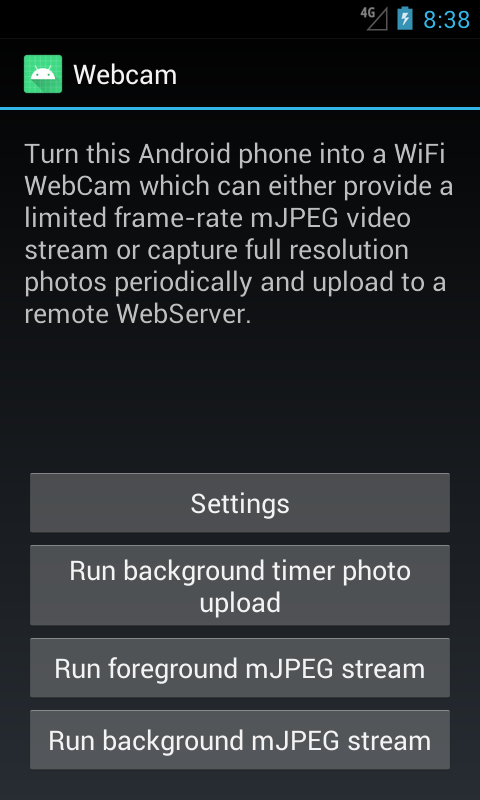
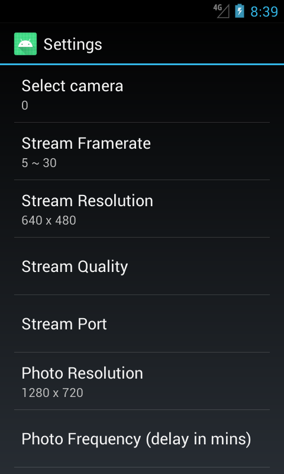

# Android WebCam
A Camera app for Android 4.X or lower phones - which will take a photo every X minutes and can upload to a webserver, or can provide a mJPEG video stream directly from the device.

Use Android Developer and import the project as an API 15 level project. 

## Features
* Can provide a video stream directly from the Android phone (just connect to its IP address); or
* Can take full-resolution photo captures and upload to a remote webserver.

## Requirements
* Crap old Android phone.
* Internet access.
* Webserver with PHP or whatever.

## Instructions
For period photo capture:
1) Install the scripts in public_html/ onto your webserver of choice. Make sure uploads/ is writable by the httpd server.
2) Compile and install the Android App onto the phone.
3) Change the upload address / URL in the app settings page, to that of your webserver.
4) Adjust the user-agent check (or remove it entirely) in the upload.php file, so that the script accepts uploads from your phone User-Agent. 

For mJPEG video stream:
1) Simply click on Foreground or Background mJPEG stream and go to http://IP:port of phone.

## Screenshots

## Credits
Project originally based on this project:

https://github.com/xiongyihui/Webcam